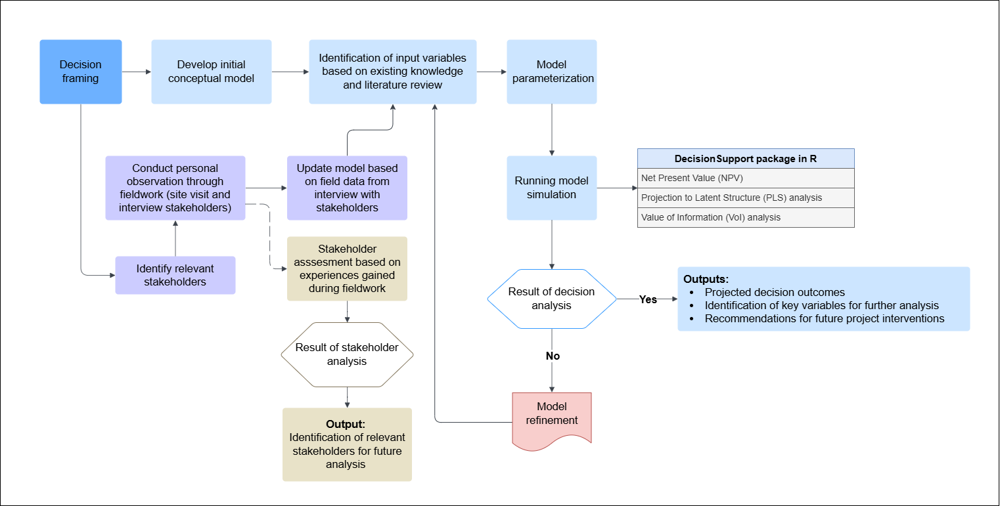
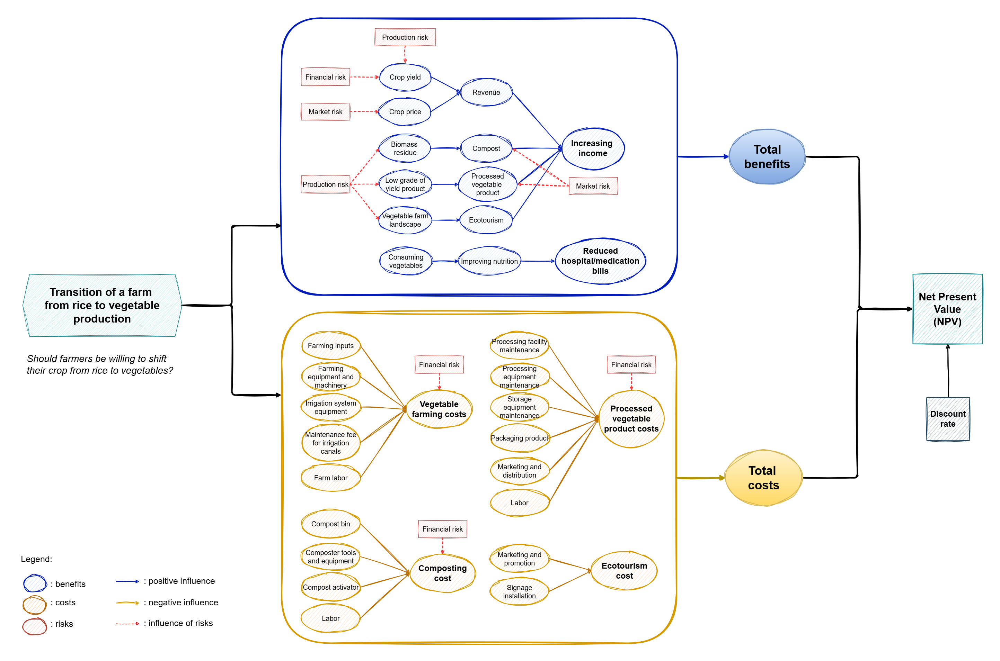
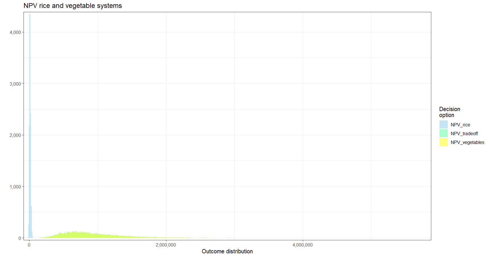
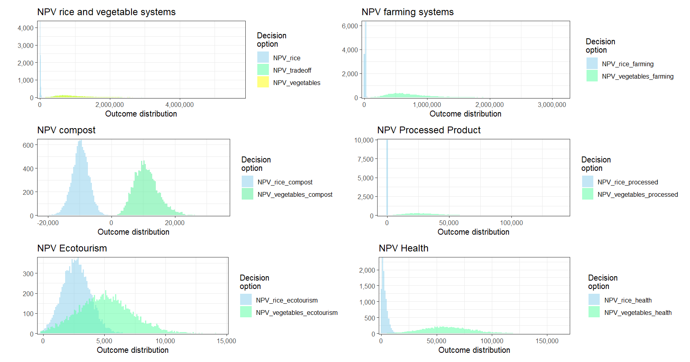
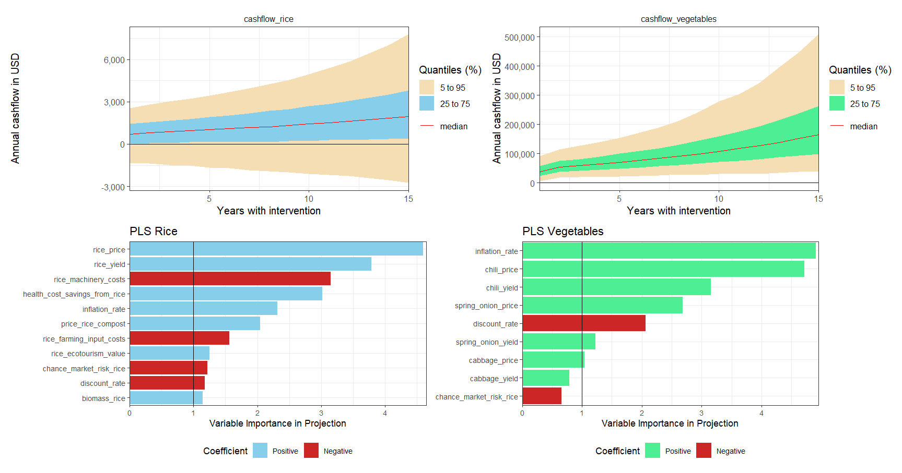
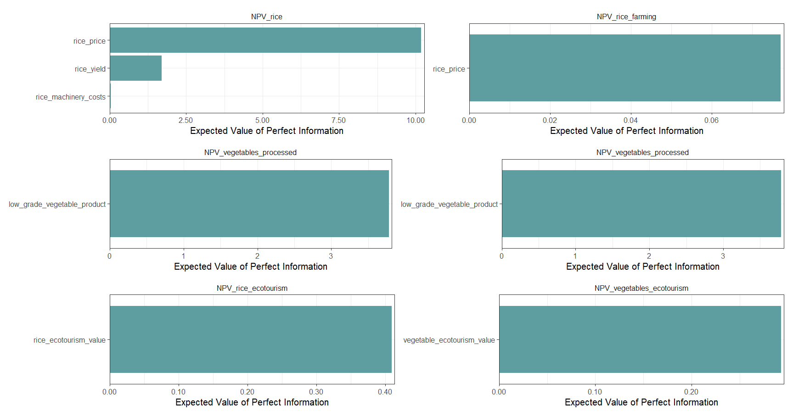

## Decision analysis of the Transition from Rice to Vegetables in Upland Area of Indonesia

### 1.	Background
Indonesia is known as one of the largest rice producers in the world with rice as a primary staple food. As of 2022, Indonesia became the fourth largest rice producer after China, India, and Bangladesh, with a total production of milled rice of 34.4 million metric tons (USDA, 2023). Rice production in Indonesia is dominated by smallholder farmers, which accounts for 93% of total farmers in Indonesia (FAO, 2018). South Sulawesi province is the largest rice-producing region in the east of Indonesia. However, in 2023, there was a significant decrease in rice production in South Sulawesi (BPS, 2023). Generally, rice is cultivated in lowland areas as its yield is higher than that of rice cultivated in upland areas (Swamy and Kumar, 2012). Additionally, upland rice takes longer to grow compared to lowland rice, limiting farmers’ chances of fast cash return income. This may lead rice farmers in upland areas to consider shifting their main crop from rice to vegetables. 

In Indonesia, most of the vegetable farming is found in the upland area. South Sulawesi is also known as one of the major producers of vegetables in Indonesia. Many upland vegetable crops such as potato, shallot, and cabbage have higher cash value than rice (Arsanti and Böhme, 2018). Despite vegetables typically having a higher cash value than rice, it needs to be taken into account that the market prices for vegetables in Indonesia tend to fluctuate more significantly than that of rice. Price fluctuation is often influenced by seasonal variations and market demands, potentially resulting in income instability for farmers. Moreover, the existing agricultural policies like fertilizer subsidies for targeted smallholder farmers might influence farmers’ decisions on whether to shift their main crop from rice to vegetables or not. 

The transition from rice to vegetables in upland areas might have implications in the overall sustainability dimension, including economic, social, and ecological. This transition may impact farmers and local livelihood including their income and nutritional health. Recognizing and considering the uncertainties and potential risks integrated into the decision-making process is important. Therefore, understanding the drivers, implications, and sustainability of such decisions is crucial for enhancing agricultural practices and rural livelihoods in Indonesia.

### 2.	Objectives
This study aims to achieve the following objectives:
1.	Understand the key factors influencing smallholder farmers’ decision to shift from rice to vegetable crops.
2.	Analyze the long-term viability of rice and vegetable crop production.
3.	Provide recommendations for farmers and policy-makers in deciding better agricultural practices between rice and vegetable crop production.

### 3. Material and Methods
#### A. Overview of Methodological Approach
This study employs a comprehensive methodology to explore the transition from rice to vegetable cultivation in West Sinjai, Sinjai Regency, South Sulawesi Province, Indonesia. The approach integrates decision analysis, qualitative fieldwork, and stakeholder assessment. The process is structured into several key phases: model development, identification of input variables, model parameterization, data collection through qualitative interviews, and iterative model refinement. This integrated approach ensures that the analysis is robust and grounded in empirical observations.

#### B. Data Collection
This study was conducted from April to May 2024 in West Sinjai district of Sinjai Regency, South Sulawesi Province, Indonesia, located between 5°2’56” - 5°21’16” South Latitude and 119°56’30” - 120°25’33” East Longitude. Sinjai Regency is characterized by diverse geographical features, including mountainous areas that are mostly located in the Western part of Sinjai. This area is known to have significant potential for agricultural production in South Sulawesi, including rice and vegetable crops.

A total of 48 respondents have been interviewed, starting with farmers engaged in transitioning from rice to vegetable cultivation and expanding to other stakeholders through referrals, including wholesalers, retailers, agricultural extension workers, researchers, and government representatives. The respondents were selected using a snowball sampling approach as it is effective and efficient in accessing key informants and building trust within the community (Cohen & Arieli, 2011). The initial respondent is identified with the criteria that meet the topic of study (Bhattacherjee etal., n.d.). Initially, targeting farmers engaged in crop-shifting practices. Additional respondents were identified through referrals from initial interviewees and recommendations from agricultural extension workers. The interview was conducted with a semi-structured technique. Preset questions related to the topic have been prepared, with free additional questions following up to the preset question. Key points such as motivations, benefits, costs, challenges, and proposed solutions were gathered during the interviews.

#### C. Conceptual Model
A conceptual model was developed to understand the system dynamics and the interrelationships between key variables. This step established a foundation for the analysis. The development process and identification of relevant input variables were guided by existing knowledge and a literature review. Each variable was selected based on its relevance to the research questions and its potential impact on the system. The variables were then parameterized to enable their integration into the model for subsequent simulation and analysis.

The following is the updated conceptual model after gathering information from relevant stakeholders.

#### D. Decision Analysis
The refined model was employed to conduct a comprehensive decision analysis using the DecisionSupport package in R (Luedeling et al., 2015). This package enabled the evaluation of decision outcomes including Net Present Value (NPV), Projection to Latent Structure (PLS) analysis, and Value of Information (VoI) analysis. The conceptual model was converted into a mathematical model for quantification and executed 10,000 times of simulation using the Monte Carlo simulation function included in the package. 
The values for the input variables used in the model were estimated from field data gathered through interviews with stakeholders, experts' knowledge, calibration, literature review, and personal judgment. The input variables comprised benefit variables and cost variables. 

### 4. Results and Discussion
###### _Note: this part is still need to be updated_

The following shows the distribution plot of the decision options.
#### NPV distribution plot of rice and vegetable systems

#### NPV distribution plot of all benefits

#### Cashflow and PLS plots of rice and vegetable systems

#### EVPI plots

###### _To be updated..._

### 5. Conclusion

_To be updated...._

### 6. Annex

