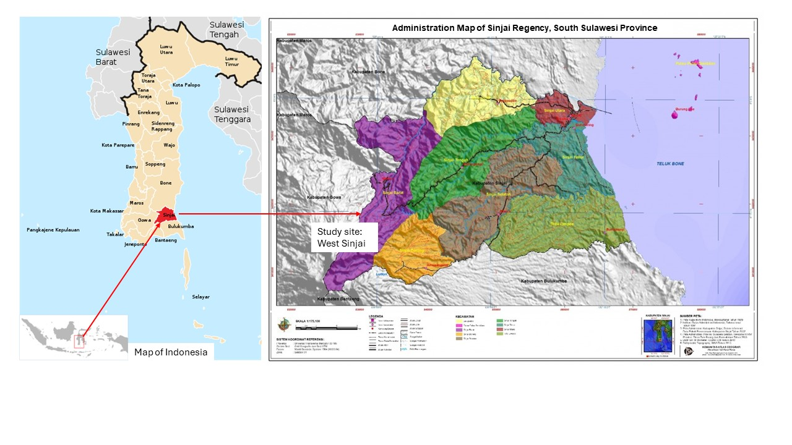
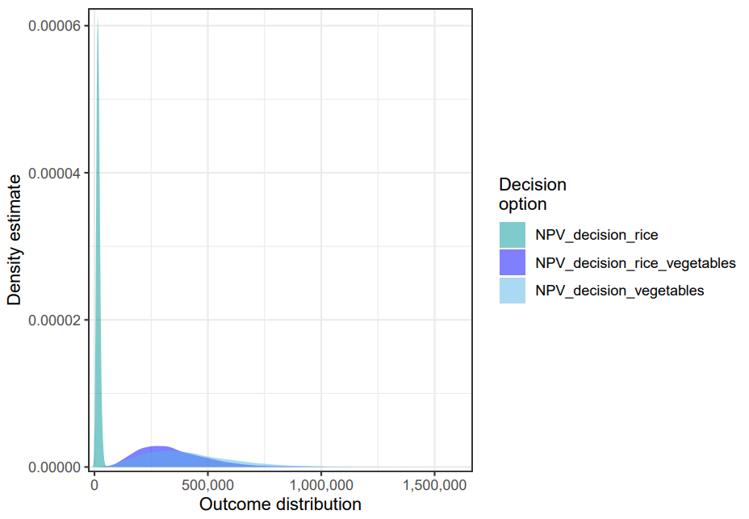
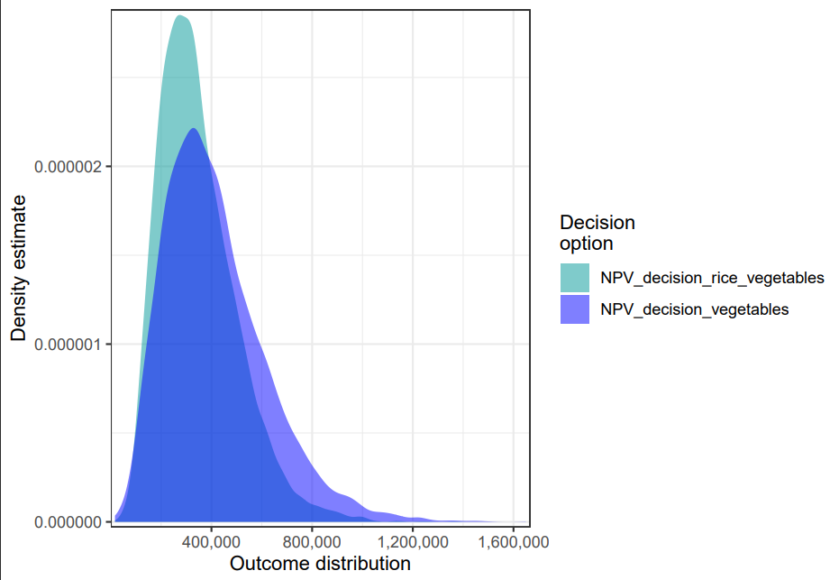
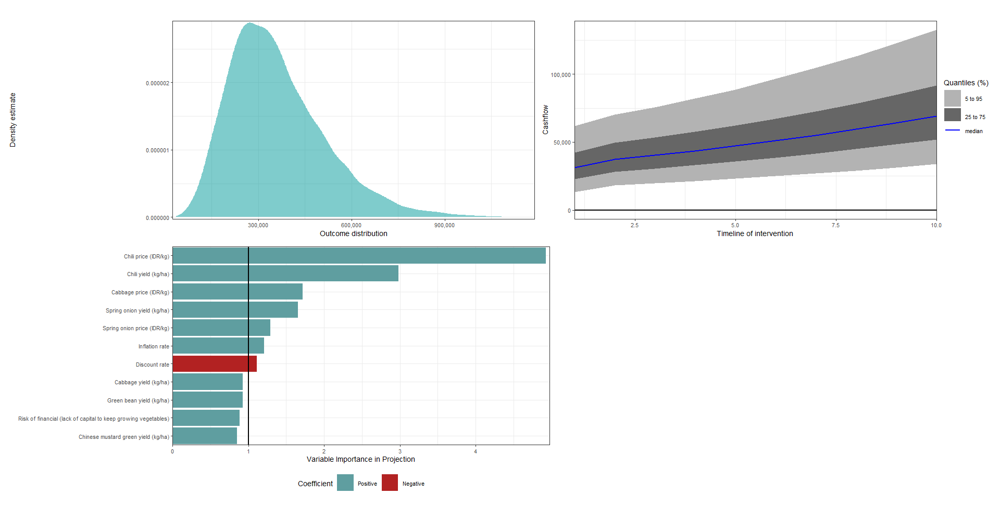

# Study site
This study was conducted from April to May 2024 in West Sinjai district of Sinjai Regency, South Sulawesi Province, Indonesia, located between 5°2’56” - 5°21’16” South Latitude and 119°56’30” - 120°25’33” East Longitude. Sinjai Regency is characterized by diverse geographical features, including mountainous areas that are mostly located in the Western part of Sinjai. This area is known to have significant potential for agricultural production in South Sulawesi, including rice and vegetable crops.

# Conceptual model
The following is the updated conceptual model after gathering information from relevant stakeholders.

There are three decision options analyzed in this study, as follows:
1) Growing rice
2) Growing vegetables
3) Growing both rice and vegetables

The following shows the distribution plot of the three decision options.

The following shows the result from each option.

#### Decision option 1: Growing rice

#### Decision option 2: Growing Vegetables

#### Decision option 3: Growing both rice and vegetables

# Conclusion

The transition from traditional rice cultivation to vegetable farming in the West Sinjai district, especially in Gunung Perak and Barania villages, reflects a significant shift influenced by economic factors and observations of successful fellow farmers. According to the analysis on farmers' decision with three options: (1) Growing rice, (2) Growing vegetables, (3) Growing both rice and vegetables), it is found that growing vegetables only may offer higher returns and faster cash flow growth compared to other options. This appears to be the most promising option for farmers for the next decade.

While this transition has diversified farmers’ income streams and improved the local community’s diet, challenges such as water scarcity and fertilizer shortages persist, mainly impacting agricultural productivity. Additionally, the potential extinction of local red paddy varieties raises concerns about preserving agricultural biodiversity. Despite these challenges, local farmers continue to adapt by forming cooperative groups to address common issues in their farming activities. 
Looking ahead, sustainable solutions and government support are essential to overcome these challenges and ensure the prosperity of agricultural communities in West Sinjai.

