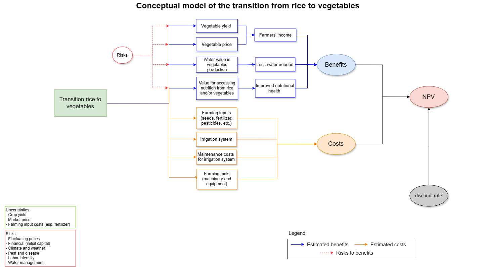
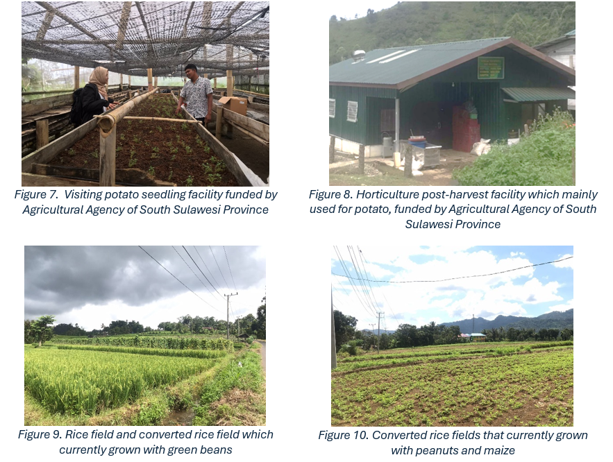

```{r setup, include=FALSE}
knitr::opts_chunk$set(echo = FALSE, warning = FALSE)
```

[github repository](https://github.com/noviriasyifaunnafsi/transition-from-rice-to-vegetables)

# Methodology

## Study Site

This study was conducted from April to May 2024 in West Sinjai district of Sinjai Regency, South Sulawesi Province, Indonesia, located between 5°2'56" - 5°21'16" South Latitude and 119°56'30" - 120°25'33" East Longitude. Sinjai Regency is characterized by diverse geographical features, including mountainous areas that are most located in Western part of Sinjai. This area is known to have significant potential for agricultural production in South Sulawesi, including rice and vegetable crops. 

{width=50%}


{width=80%}

## Data Source

Qualitative interviews were conducted with stakeholders to gather insights into agricultural transition practices from rice to vegetables in West Sinjai, Sinjai Regency, South Sulawesi Province Indonesia in April 2024. The respondents were selected using a snowball sampling approach, initially targeting farmers engaged in crop-shifting practices. Additional respondents were identified through referrals from initial interviewees and recommendations from agricultural extension workers. Key points such as motivations, benefits, costs, challenges, and proposed solutions were gathered during the interviews.

The respondents represented various stakeholders involved in agricultural activities within the study site, including:


```{r, echo=FALSE, include=FALSE}
library(readxl)
library(knitr)

number_respondents <- read_excel("number of respondents.xlsx", sheet = "Sheet1")

kable(number_respondents, caption = "Stakeholders interviewed during study")

```

The following shows the stakeholder engagement analysis for this study.

```{r, echo = FALSE}
library(tidyverse)
library(ggplot2)
library(ggrepel)
library(ggthemes)

stakeholder <- read.csv("stakeholders.csv")

ggplot(data = stakeholder, aes(x = Experience, 
                               y = Availability,
                               label = stakeholders, 
                               color = Expertise)) + 
  geom_point(aes(shape=Gender)) +
  xlab("Relevant Experience") +
  
  #label names of stakeholders and expand space to show full names
  scale_x_continuous(labels = paste(seq(0, 5, by = 1)), 
                     breaks = seq(0, 5, by = 1), 
                     limits = c(0, 5),
                     expand = c(0, 1)) +
  scale_y_continuous(labels = paste(seq(0, 5, by = 1)), 
                     breaks = seq(0, 5, by = 1), 
                     limits = c(0, 5),
                     expand = c(0, 1)) +
  theme(plot.margin = unit(c(1, 1, 1, 1), "cm")) +
  theme(legend.position = "none") +
  
  # Create line to categorize stakeholders
  geom_hline(yintercept=2.5, color="white", size=2) +
  geom_vline(xintercept=2.5, color="white", size=2) +
  
  # Show all names of overlapped values
  geom_text_repel(box.padding = 0.3, max.overlaps = Inf, size = 3) +
  annotate("text", label = "Potential core experts",
           x = 4.5, y = 3.2, size = 5, color = "grey48") +
  annotate("text", label = "Resource persons",
           x = 4.5, y = 0.25, size = 5, color = "grey48")


```


# Summary of Findings

## 1. General condition

In the past, most people in West Sinjai grew local varieties of red paddy known as Taddaga, Banda’, and Lappung. In addition to that, they also cultivated tobacco, maize, and coffee. However, in the early 1990s, someone from West Java arrived in Gunung Perak village (elevation approx. 1,000-1,500 meters above sea level) to introduce vegetable farming such as potato, cabbage, carrot, and more. Eventually, he became a pioneer of vegetable farming in the area. 

It took nearly a decade for other farmers to be influenced to begin growing vegetables. Over the past 10-15 years, many farmers in the West Sinjai district, especially those in Gunung Perak and Barania villages, have transitioned their cultivation practices from traditional rice cultivation to vegetable farming. The decision of many farmers to shift to vegetables was mainly motivated by observing the success of fellow farmers in vegetable farming, demonstrating higher profitability compared to rice and other common crops such as maize and tobacco. Some farmers claimed that vegetables may yield three times higher profit than rice. 

Currently, most farmers cultivate a variety of vegetables alongside rice, while a few of them alternate between rice and vegetables on the same field. Those who continue to grow rice mainly do so for their consumption, selling only if their family’s needs are met. There is a strong social value placed on being able to produce one’s own rice, viewed as a source of pride for local people. Therefore, some farmers with multiple fields prefer to continue to grow rice as long as there is sufficient water for irrigation. 

According to the head of agricultural extension workers in West Sinjai, only a few farmers still grow local red paddy varieties (Taddaga, Banda’, and Lappung). These varieties can only be cultivated in areas with elevations of > 1,000 masl. Farmers who continue to grow these types of rice do so only for their own consumption and not for sale. This raises concerns about the potential extinction of these local varieties in the future.

Farmers residing at the lower altitude (< 700 masl) predominantly grow rice and perennial crops such as cocoa, cloves, coffee, and local fruit trees. Only a small percentage (approx. 7%) of them grow vegetables such as chili, tomato, and cucumber. Their main reason for continuing rice cultivation is the pride associated with providing their own staple food over others. They rely on the production of perennial crops and cattle farming as their main source of income.

According to farmers, there is no government intervention in their decision-making on shifting their crops from rice to vegetables. However, since the late 1990s, more farmers seem to have found greater success with vegetables. As a result, the government has officially started to provide assistance, including road infrastructure, seedling facility (Figure 7), horticulture post-harvest facility (Figure 8), and farming inputs such as seeds and fertilizers. 

According to farmers, there has not been a significant change in their consumption patterns despite shifting to vegetable crops, as they were able to purchase vegetables for their consumption needs at the market even before. However, compared to the 1990s, people claimed that the community’s consumption patterns have significantly improved, especially since vegetable cultivation began in the Gunung Perak village. Previously, people mainly consumed rice mixed with maize as their staple food due to the difficulty in accessing other foods. But with the introduction of vegetable crops in that area, the community’s diet has become much more diverse than before.

Many smallholder farmers are still involved in profit profit-sharing system known as ‘Tesang’, which refers to an arrangement between landowners and farmers to share profits from crop yields. Landowners often provide land and initial capital, while farmers handle fieldwork, crop management, and harvesting. Profits are divided based on their deal, often based on predetermined percentages or fixed shares, allowing both parties to benefit from the harvest while sharing risks and rewards. 


## 2. Issues

Most farmers mentioned that water scarcity is one of the major issues they face, especially during the dry season. In some villages such as Barania, Bontosalama, and Turungan Baji, this water scarcity poses a significant challenge for rice cultivation, especially during the dry season. Consequently, some farmers have opted to convert their rice fields into dry fields that are suitable for growing vegetables or other staple crops such as maize and peanuts. Compounding the issue, broken irrigation channels have exacerbated water scarcity over the past two years. The government, under the Ministry of Public Works and Housing, typically undertakes maintenance and repairs of the irrigation channels, which is done every five years, and the last repairs were completed in 2023. Despite these efforts, many sections remain unrepaired, leaving nearly 80 ha of rice fields unable to be irrigated. Consequently, these fields have been converted for maize and peanut cultivation. Many farmers aspire to own a water pond that can at least provide sufficient water storage for irrigating vegetable fields, especially during the dry season. However, they don’t have enough capital to construct one, and there is also limited space available in their field for such construction. 

Another issue faced by farmers is the shortage of chemical subsidized fertilizer (Urea, NPK, and ZA) that has persisted for the past two years. This shortage has forced farmers to deal with higher fertilizer costs. However, some farmers claimed that this has not significantly impacted their income, as the farmgate price of vegetables has increased, though with continued price fluctuations. Most farmers find it challenging to predict these fluctuations, as according to them, vegetable prices are heavily influenced by the supply of vegetables from other areas in Sulawesi, especially from Enrekang regency in South Sulawesi which is also known as one of the biggest vegetable producers in Sulawesi.

Furthermore, capital for vegetable cultivation has also become an issue for farmers, especially smallholder farmers. Therefore, many farmers rely on Banks for assistance by applying micro-credit program (Kredit Usaha Rakyat/KUR) for their capital. Typically, payments are made according to the harvest schedule. 


## 3. Marketing

wholesalers, retailers, or selling it themselves. Farmers often have the option to sell their vegetables directly in the fields to retailers who then resell the products in local markets or nearby regions. Many farmers find it convenient to sell their vegetables directly to retailers who visit their fields to purchase produces. These retailers often transport the vegetables to local markets or nearby areas for resale to consumers. This direct transaction allows farmers to quickly sell their products without the need for intermediaries. There are also wholesalers who purchase vegetables from local farmers and resell them to other retailers in other areas within the same province (Sulawesi) and different provinces (Kalimantan and Nusa Tenggara). The wholesalers and retailers are often women with husbands working as farmers. The prices paid to farmers are typically determined by wholesalers and retailers based on the prevailing market rates. However, in situations where the supply is limited, farmers may have more control over pricing. 

{width=50%}


As for rice, most farmers, especially those who primarily produce for their own consumption, sell their rice directly to rice mills. Upon milling their rice at these mills, farmers are required to compensate rice mills with 20 liters of rice for every 100 liters of rice they have. Afterward, the rice mills proceed to sell the rice to traders or government agencies (BULOG). Farmers who grow rice for commercial purposes sell their rice directly to traders upon milling and receiving payment in cash.


## 4. Local Farmers' groups

During the interviews, there are several local farmers’ groups in this area that I have been observed including: 

*	Farmer group (Kelompok Tani): a community-based organization that comprises small-scale farmers who come together to collaborate on various aspects of agricultural production, marketing, and community. Farmer groups serve as platforms for farmers to share knowledge, resources, and experiences, collaborate on agricultural activities such as land preparation and harvesting, access government support programs and agricultural extension services, and collectively address common challenges faced by farmers in their community.
*	Federation of farmer group (Gabungan Kelompok Tani/Gapoktan): a federation of farmers groups within the same village that serves as a coordinating body that facilitates communication and collaboration among individual farmer groups.
*	Women farmer group (Kelompok Wanita Tani/KWT): a specialized farmer group composed primarily of women engaged in agricultural activities including post-harvest management. 
* Association of farmer water users (Perkumpulan Petani Pemakai Air/P3A): a community-based organization responsible for managing water resources and irrigation systems within the village. It plays a crucial role in overseeing the distribution and allocation of water for agricultural purposes, maintaining irrigation infrastructure, resolving conflicts related to water usage, and facilitating collaboration between farmers and government agencies involved in water resource management.

All groups except for the association of farmer water users are actively guided by agricultural extension workers. Meanwhile, the association of farmer water users is actively cooperating with Farmer groups and the village government.


## 5. Government Agricultural Policies


After conducting interviews with stakeholders from the Sinjai Regency Agricultural Agency and the South Sulawesi Provincial Agricultural Agency, it is known that there is no direct intervention from the government on farmers’ decision in shifting their crops from rice to vegetables. It is also discovered that the Indonesian government prioritizes policies and programs for food crops, especially rice, as it is the main staple food for Indonesians. Consequently, most assistance provided to farmers is focused on rice cultivation, including seeds, fertilizers, irrigation, and machinery. However, starting this year, the South Sulawesi Provincial Government is focusing on developing horticultural crops, particularly breadfruit and jackfruit. Unfortunately, there is currently no specific attention given to upland vegetables by the government. Assistance for vegetable farmers exists but is limited, as the government perceives that most vegetable farmers are large-scale and less in need of support compared to most rice farmers. Due to budget constraints, the government currently focuses its assistance on nine strategic commodities that are most likely impacted by inflation including rice, chili, coffee, and cocoa. 

The Agricultural Agencies are unable to control market prices, especially for vegetables. Price regulations are typically overseen by trade agencies under the Ministry of Trade. However, for rice, the government set maximum retail price regulations to ensure affordability, considering its status as a staple food. The government provides post-harvest facilities for horticultural commodities, including warehouse and processing machinery to farmer groups to help increase the market value of their product when prices are low. On the other hand, when horticultural commodity prices increase, the government sometimes organizes “discount markets” to help consumers afford the products at more affordable prices. 


# Conceptual model

The following is the updated conceptual model after gathering information from relevant stakeholders.





```{r transition_from_rice_to_vegetables, echo=FALSE, include=FALSE, warning=FALSE}
library(decisionSupport)
library(gtExtras)
library(svglite)

input_estimates <- read.csv("input_rice_to_vegs_(USD).csv", sep = ",")

make_variables <- function(est,n=1)
{ x<-random(rho=est, n=n)
for(i in colnames(x)) assign(i,
                             as.numeric(x[1,i]),envir=.GlobalEnv)
}

make_variables(as.estimate(input_estimates))

transition_rice_to_vegetables <- function(x, varnames){
  

  # Estimate the cost for 1 ha of field #
  
  # option 1 (rice)
  # annual cost for rice, assuming farmers grow rice twice per year
  ## annual rice costs
  rice_cost_precal <- ((rice_farming_input_costs + rice_machinery_costs + rice_labor_costs)*2) + 
                        irrigation_maintenance_costs #to be paid to farmers' group or water user association of local farmers' group
  rice_cost <- vv(rice_cost_precal, n_year, var_CV=CV_value)
  
  # option 2 (vegetables)
  # annual cost for vegetables, assuming farmers grow vegetables with mix cropping (5 crops per year)
  ## annual vegetable costs
  vegetables_cost_precal <- vegetables_farming_input_costs + #seeds, fertilizer, pesticides, plastic mulch, etc.
                              vegetables_machinery_costs + #assuming the machinery is used alternately among farmers, cost is only for fuel
                              vegetables_labor_costs +  irrigation_maintenance_costs
  vegetables_cost <- vv(vegetables_cost_precal, n_year, var_CV=CV_value)

  # calculating the implementation costs of growing vegetables (other costs that might need to be paid for vegetables)
    
    if (implementation_vegetables){
      cost_implementation_vegetables <- vegetables_cost + vegetables_equipment_costs + vegetables_irrigation_costs
    } else{
      cost_implementation_vegetables <- 0
    }
    
    # calculating the establishment costs that will be paid only for the first year of implementation cultivating vegetables
    establishment_vegetables_cost <- rep(0, n_year)
    
    if (implementation_transition_to_vegetables){
      establishment_vegetables_cost <-
        establishment_vegetables_cost + vv(vegetables_equipment_costs + vegetables_irrigation_costs, 
                                           var_CV=CV_value, n_year)
      
      intervention_vegetable_cost <- establishment_vegetables_cost
      
      #intervention cost for first year 
      intervention_vegetable_cost[1] <- cost_implementation_vegetables 
    }
    
    
  # option 3 (cultivate both rice and vegetables separately)
  ## cultivate rice in 0.5 ha and vegetables in 0.5 ha
  ### total cost both rice and vegetables 
  rice_vegs_total_costs_precal <- (rice_cost/2) + (vegetables_cost/2)
  rice_vegs_total_costs <-   vv(rice_vegs_total_costs_precal, n_year, var_CV=CV_value, relative_trend = inflation_rate)
  
  
  # calculating the implementation costs of growing vegetables (other costs that might need to be paid for vegetables)
  
  if (implementation_rice_and_vegetables){
    cost_implementation_rice_and_vegetables <- rice_cost + vegetables_cost + 
                                              (vegetables_equipment_costs/2) + (vegetables_irrigation_costs/2)
  } else{
    cost_implementation_rice_and_vegetables <- 0
  }
  
  # calculating the establishment costs that will be paid only for the first year of implementation cultivating vegetables
  establishment_rice_and_vegetables_cost <- rep(0, n_year)
  
  if (implementation_rice_and_vegetables){
    establishment_rice_and_vegetables_cost <-
      establishment_rice_and_vegetables_cost + vv(vegetables_equipment_costs + vegetables_irrigation_costs, 
                                         var_CV=CV_value, n_year)
    
    intervention_rice_and_vegetable_cost <- establishment_rice_and_vegetables_cost
    
    #intervention cost for first year 
    intervention_rice_and_vegetable_cost[1] <- cost_implementation_rice_and_vegetables 
  }
  
  
  # Risks ##
  
  ## Risks that may occur in rice production (option 1)
  ## these risks may affect farmers' income if they grow rice
  
  risk_crop_failure_rice <- risk_failure_climate_weather_rice + risk_failure_pest_disease_rice
  
  rice_production_risk <- (risk_crop_failure_rice + #loss or low harvest
                             risk_price_fluctuation_rice + # low market price
                             risk_capital_rice + # low capital to continue grow rice
                             risk_water_shortage_rice + # water shortage during planting
                             risk_labor_shortage_rice) #labor shortage in growing rice
                             
  ## Risk that may affect water resource
  rice_water_resource_risk <- risk_water_shortage_rice 
  
  # Risk that may 'indirectly' affect nutritional health value of people
  rice_nutritional_to_health_value_risk <- (risk_crop_failure_rice + # crop failure may influence the rice consumption pattern (?)
                                              risk_price_fluctuation_rice) # price fluctuation may influence the rice consumption pattern (?)
  
  
  ## Risk that may occur in vegetables production (option 2)
  ## these risks may affect farmers' income if they grow vegetables
  
  risk_crop_failure_vegetables <- risk_failure_climate_weather_vegetables + risk_failure_pest_disease_vegetables
  
  vegetables_production_risk <- (risk_crop_failure_vegetables + #loss or low harvest
                                   risk_price_fluctuation_vegetables + # low market price
                                   risk_capital_vegetables + # low capital to continue grow vegetables
                                   risk_water_shortage_vegetables + # water shortage during planting
                                   risk_labor_shortage_vegetables) #labor shortage in growing vegetables
                                   
  ## Risk that may affect water resource
  vegetables_water_resource_risk <- risk_water_shortage_vegetables # risk of water shortage due to vegetables cultivation
  
  # Risk that may 'indirectly' affect nutritional health value of people
  vegetables_nutritional_to_health_value_risk <- (risk_crop_failure_vegetables + # crop failure may influence the vegetables consumption pattern (?)
                                                    risk_price_fluctuation_vegetables) # price fluctuation may influence the consumption pattern of vegetables (?)
  
  
  
  ## Risk that may occur in growing both rice and vegetables (option 3)
  rice_vegetables_production_risk <- risk_crop_failure_rice + #loss or low harvest
                                      risk_crop_failure_vegetables + #loss or low harvest  
                                      risk_price_fluctuation_rice + # low market price for rice
                                      risk_price_fluctuation_vegetables + # low market price for vegetables
                                      risk_capital_rice + # low capital to continue grow rice
                                      risk_capital_vegetables + # low capital to continue grow vegetables
                                      risk_water_shortage_rice + # water shortage during planting
                                      risk_water_shortage_vegetables + # water shortage during planting
                                      risk_labor_shortage_rice + #labor shortage in growing rice
                                      risk_labor_shortage_vegetables #labor shortage in growing vegetables
                                          
  ## Risk that may affect water resource
  rice_vegetables_water_resource_risk <- risk_water_shortage_rice + # risk of water shortage due to rice cultivation
                                          risk_water_shortage_vegetables # risk of water shortage due to vegetables cultivation
  
  # Risk that may 'indirectly' affect nutritional health value of people
  rice_vegetables_nutritional_to_health_value_risk <- risk_crop_failure_rice + # crop failure may influence the rice consumption pattern (?)
                                                      risk_price_fluctuation_vegetables + # price fluctuation may influence the consumption pattern of rice (?)
                                                      risk_crop_failure_vegetables + # crop failure may influence the rice consumption pattern (?)
                                                      risk_price_fluctuation_vegetables # price fluctuation may influence the consumption pattern of vegetables (?) 
  
  
  
  # Estimate the benefits
  
  ## annual income for rice, assuming they grow rice 2 times per year
  ## annual income for rice per ha
  rice_income_precal <- (rice_yield *rice_price)*2
  rice_income <- vv(rice_income_precal, n_year, var_CV=CV_value)
  
  ## calculate rice income with risks
  rice_income_value <- vv(rice_income, n_year, var_CV=CV_value, 
                          relative_trend = inflation_rate) * rice_production_risk
  
  
  
  ## value of water in rice production (USD/ha)
  
  ## value of water in 1 ha
  rice_water_value_precal <- (rice_water_use * rice_water_value)*2 #rice water use is in (m3/ha) times estimated value of water used in rice production (USD/m3)
  
  rice_water_value <- vv(rice_water_value_precal, n_year, var_CV=CV_value,
                         relative_trend = inflation_rate) * rice_water_resource_risk # consider water shortage may happen (?)
  
  
  ###rice nutrition to health value (USD/ha) #estimated yearly value for accessing nutrition from rice
  rice_nutrition_health_value <- vv(rice_nutrition_to_health_value, 
                                       n_year, var_CV=CV_value,
                                       relative_trend = inflation_rate) * rice_nutritional_to_health_value_risk
  
  
  ### annual income for vegetables, assuming they grow 5 different vegetables per year
  chinese_mustard_green_income <- (chinese_mustard_green_yield*chinese_mustard_green_price) * 0.4 #assuming it is cultivated in 0.4 ha for each season and twice per year
  green_bean_income <- (green_bean_yield*green_bean_price) *  0.8 #assuming it is cultivated in 0.8 ha for each season and once per year
  cabbage_income <- (cabbage_yield*cabbage_price) * 0.8 ##assuming it is cultivated in 0.4 ha for each season and twice per year
  chili_income <- (chili_yield*chili_price) * 0.8 #assuming it is cultivated in 0.8 ha for each season and once per year
  tomato_income <- (tomato_yield*tomato_price) * 0.8 #assuming it is cultivated in 0.8 ha for each season and once per year
  spring_onion_income <- (spring_onion_yield*spring_onion_price) #assuming it is mixed with any crop, 0.2 ha for each season
  
  # annual income from vegetables per ha
  vegetables_income_precal <- chinese_mustard_green_income + green_bean_income +
                              cabbage_income + chili_income + spring_onion_income
  vegetables_income <- vv(vegetables_income_precal, n_year, var_CV=CV_value)
  
  ### calculate vegetables income value with risk
  vegetables_income_value <- vv(vegetables_income, n_year, var_CV=CV_value,
                                relative_trend = inflation_rate) * vegetables_production_risk
  
  
  ## value of water used for vegetable production (USD/ha), assuming that the value of water used for all vegetables are similar
  
  ## value of water in growing vegetables 
  vegetables_water_value <- (vegetables_water_use * vegetables_water_value) * 3 # assuming vegetables can be cultivated at least 3 season per year
  
  
  ###vegetables nutrition to health value (USD/ha)
  vegetables_nutrition_health_value <- vv(vegetables_nutrition_to_health_value,
                                             n_year, var_CV=CV_value,
                                             relative_trend = inflation_rate) * vegetables_nutritional_to_health_value_risk #estimated yearly value for accessing nutrition from vegetables
  
  
  
  ##if farmers grow both rice and vegetables
  ## calculate annual income both rice and vegetables
  rice_vegetables_income_value_precal <- (rice_income/2) + (vegetables_income/2) #assuming rice and vegetables are cultivated in 0.5 ha field for each
  rice_vegetables_income_value <- vv(rice_vegetables_income_value_precal,
                                          n_year, var_CV=CV_value, relative_trend = inflation_rate) * rice_vegetables_production_risk
  
  
  ###value of water used both rice and vegetables 
  rice_vegetables_water_value_precal <- rice_water_value + vegetables_water_value # assuming that rice and vegetables can be cultivated ate least once per year
  rice_vegetables_water_value <- vv(rice_vegetables_water_value_precal, #value of water used for production (USD/ha)
                                  n_year, var_CV=CV_value, relative_trend = inflation_rate) * rice_vegetables_water_resource_risk # consider water shortage may happen (?)
  
  
  ###nutrition to health value from both rice and vegetables
  rice_vegetables_nutritional_health_value_precal <- (rice_nutrition_health_value/2) + 
                                                  (vegetables_nutrition_health_value/2)
  rice_vegetables_nutritional_health_value <- vv(rice_vegetables_nutritional_health_value_precal, 
                                                 n_year, var_CV=CV_value, relative_trend = inflation_rate )
  
  # Sum up all benefits
  rice_total_benefit <- rice_income_value + rice_water_value + rice_nutrition_to_health_value
  vegetables_total_benefit <- vegetables_income_value + vegetables_water_value + vegetables_nutrition_to_health_value
  rice_vegetables_total_benefit <- rice_vegetables_income_value + rice_vegetables_water_value + rice_vegetables_nutritional_health_value
  
  
  # Final results
  ## option 1: if farmers grow rice
  rice_result <- rice_total_benefit - rice_cost
  
  ## option 2: if farmers grow vegetables
  vegetables_result <- vegetables_total_benefit - intervention_vegetable_cost
  
  ## option 3: if farmers grow both rice and vegetables
  rice_vegetables_result <- rice_vegetables_total_benefit - intervention_rice_and_vegetable_cost
  
  # Calculate NPV
  NPV_no_interv <- discount(x = rice_result, 
                            discount_rate = discount_rate, calculate_NPV = TRUE)
  
  NPV_vegetables_interv <- discount(x = vegetables_result, 
                                    discount_rate = discount_rate,
                                    calculate_NPV = TRUE)
  
  NPV_rice_vegetables_interv <- discount(x = rice_vegetables_result,
                                       discount_rate = discount_rate,
                                       calculate_NPV = TRUE)
  
  
  return(list(NPV_rice = NPV_no_interv,
              NPV_vegetables = NPV_vegetables_interv,
              NPV_rice_vegetables = NPV_rice_vegetables_interv,
              NPV_decision_rice = NPV_no_interv,
              NPV_decision_vegetables = NPV_vegetables_interv - NPV_no_interv,
              NPV_decision_rice_vegetables = NPV_rice_vegetables_interv - NPV_no_interv,
              cashflow_rice = rice_result,
              cashflow_vegetables = vegetables_result,
              cashflow_rice_vegetables = rice_vegetables_result))
}
```

### Monte Carlo Simulation Summary

```{r, echo=FALSE, warning=FALSE}
# Run the Monte Carlo simulation using the model function
input_estimates <- read.csv("input_rice_to_vegs_(USD).csv", sep = ",")

TRV_mc_simulation <- mcSimulation(estimate = as.estimate(input_estimates),
                                  model_function = transition_rice_to_vegetables,
                                  numberOfModelRuns = 10000,
                                  functionSyntax = "plainNames")


# Subset the outputs from the mcSimulation function (y) to summarize only on the variables that we want.
# names(TRV_mc_simulation$x)
mcSimulation_summary <- data.frame(TRV_mc_simulation$x[5:35],
                                   # names(TRV_mc_simulation$x)
                                   TRV_mc_simulation$y[1:6])

gtExtras::gt_plt_summary(mcSimulation_summary)
```


### Distribution plot

```{r, echo=FALSE, warning=FALSE}
# plot NPV distribution analysis
decisionSupport::plot_distributions(mcSimulation_object = TRV_mc_simulation, 
                                    vars = c("NPV_decision_rice",
                                             "NPV_decision_vegetables", 
                                             "NPV_decision_rice_vegetables"),
                                             method = 'smooth_simple_overlay')


decisionSupport::plot_distributions(mcSimulation_object = TRV_mc_simulation, 
                                    vars = c("NPV_decision_vegetables", 
                                             "NPV_decision_rice_vegetables"),
                                    method = 'smooth_simple_overlay')


decisionSupport::plot_distributions(mcSimulation_object = TRV_mc_simulation, 
                                    vars = c("NPV_decision_rice", 
                                             "NPV_decision_vegetables",
                                             "NPV_decision_rice_vegetables"),
                                    method = 'boxplot')


decisionSupport::plot_distributions(mcSimulation_object = TRV_mc_simulation, 
                                    vars = c("NPV_decision_vegetables", 
                                             "NPV_decision_rice_vegetables"),
                                    method = 'boxplot')

```


### Cashflow

```{r, echo=FALSE, warning=FALSE}
# cashflow analysis
plot_cashflow(mcSimulation_object = TRV_mc_simulation, cashflow_var_name = "cashflow_rice")
plot_cashflow(mcSimulation_object = TRV_mc_simulation, cashflow_var_name = "cashflow_vegetables")
plot_cashflow(mcSimulation_object = TRV_mc_simulation, cashflow_var_name = "cashflow_rice_vegetables")
```


### Projection to Latent Structures (PLS) analysis

```{r, echo=FALSE, warning=FALSE}

# Projection to Latent Structures (PLS) analysis
pls_result <- plsr.mcSimulation(object = TRV_mc_simulation,
                                resultName = names(TRV_mc_simulation$y)[4], ncomp = 1)
plot_pls(pls_result, threshold = 0)

pls_result <- plsr.mcSimulation(object = TRV_mc_simulation,
                                resultName = names(TRV_mc_simulation$y)[5], ncomp = 1)
plot_pls(pls_result, threshold = 0)

pls_result <- plsr.mcSimulation(object = TRV_mc_simulation,
                                resultName = names(TRV_mc_simulation$y)[6], ncomp = 1)
plot_pls(pls_result, threshold = 0)

```


### VoI analysis

```{r, echo=FALSE, warning=FALSE}
# VoI analysis
mcSimulation_table <- data.frame(TRV_mc_simulation$x, TRV_mc_simulation$y[4:6])
evpi_TRV <- multi_EVPI(mc = mcSimulation_table, first_out_var = "NPV_decision_rice")
plot_evpi(evpi_TRV, decision_vars = "NPV_decision_rice")
plot_evpi(evpi_TRV, decision_vars = "NPV_decision_vegetables")
plot_evpi(evpi_TRV, decision_vars = "NPV_decision_rice_vegetables")
```


#### Decision option 1: Growing rice

```{r, echo=FALSE, warning=FALSE}
compound_figure(mcSimulation_object = TRV_mc_simulation, 
                input_table = input_estimates, plsrResults = pls_result, 
                EVPIresults = evpi_TRV, decision_var_name = "NPV_decision_rice", 
                cashflow_var_name = "cashflow_rice", 
                base_size = 7)

```


#### Decision option 2: Growing Vegetables

```{r, echo=FALSE}
compound_figure(mcSimulation_object = TRV_mc_simulation, 
                input_table = input_estimates, plsrResults = pls_result, 
                EVPIresults = evpi_TRV, decision_var_name = "NPV_decision_vegetables", 
                cashflow_var_name = "cashflow_vegetables", 
                base_size = 7)
```


#### Decision option 3: Growing both rice and vegetables

```{r,echo=FALSE}
compound_figure(mcSimulation_object = TRV_mc_simulation, 
                input_table = input_estimates, plsrResults = pls_result, 
                EVPIresults = evpi_TRV, decision_var_name = "NPV_decision_rice_vegetables", 
                cashflow_var_name = "cashflow_rice_vegetables", 
                base_size = 7)
```


# Conclusion

The transition from traditional rice cultivation to vegetable farming in the West Sinjai district, especially in Gunung Perak and Barania villages, reflects a significant shift influenced by economic factors and observations of successful fellow farmers. According to the analysis of farmers' decisions considering three options: (1) Growing rice, (2) Growing vegetables, and (3) Growing both rice and vegetables), it is found that growing vegetables only may offer higher returns and faster cash flow growth compared to other options. This appears to be the most promising option for farmers for the next decade.

While this transition has diversified farmers’ income streams and improved the local community’s diet, challenges such as water scarcity and fertilizer shortages persist, mainly impacting agricultural productivity. Additionally, the potential extinction of local red paddy varieties raises concerns about preserving agricultural biodiversity. Despite these challenges, local farmers continue to adapt by forming cooperative groups to address common issues in their farming activities. Looking ahead, sustainable solutions and government support are essential to overcome these challenges and ensure the prosperity of agricultural communities in West Sinjai.


# Annex

The following are the documentation during the field study.





